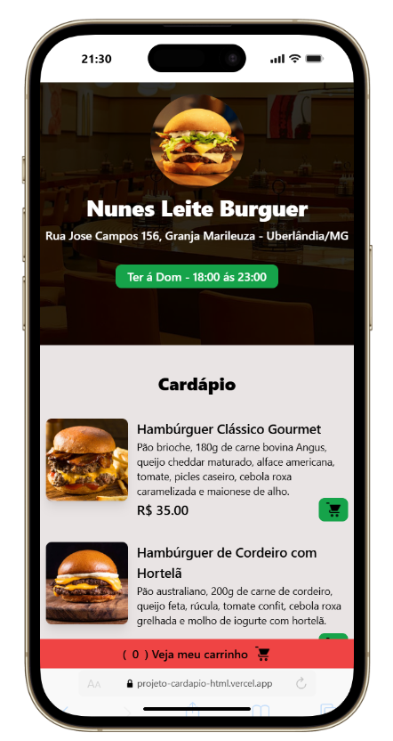
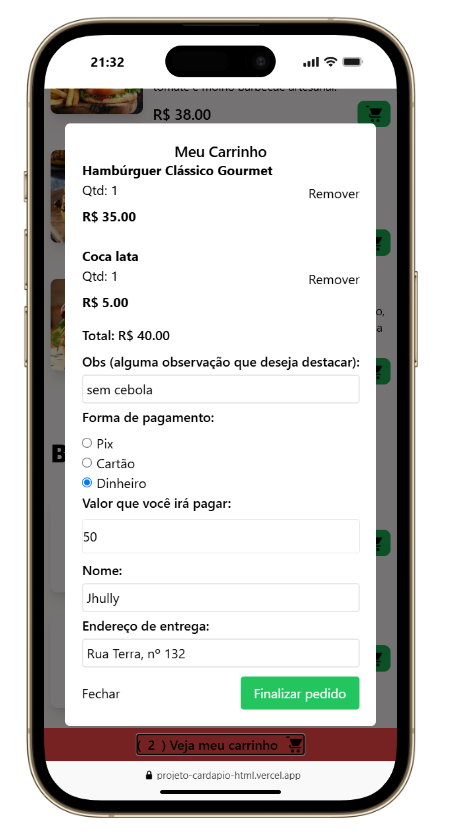
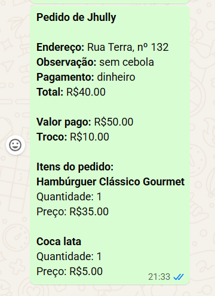

# 🍔 Nunes Leite Burguer - Cardápio Digital

Um site interativo de pedidos e cardápio digital desenvolvido para uma hamburgueria (Nunes Leite Burguer, localizada em Uberlândia/MG). O projeto oferece uma interface amigável e otimizada para dispositivos móveis, permitindo que os clientes visualizem os produtos, montem seus pedidos e os enviem diretamente para o WhatsApp do estabelecimento de forma automatizada.

## Fluxo da Aplicação

<p align="center">
  
  
  
</p>

## Funcionalidades

*   **Catálogo de Produtos:** Apresentação detalhada dos hambúrgueres com fotografia, descrição dos ingredientes e preço.
*   **Gestão de Carrinho:** Sistema interativo de adição e remoção de produtos, com atualização em tempo real do total a pagar e da quantidade de itens.
*   **Checkout Inteligente (Modal):** Formulário para coleta de dados do cliente (nome, endereço, observações) e seleção da forma de pagamento (Pix, Cartão, Dinheiro).
*   **Cálculo Automático de Troco:** Se a opção de pagamento em "Dinheiro" for selecionada, o sistema abre um campo extra e calcula automaticamente o troco necessário para o entregador.
*   **Integração com WhatsApp:** Ao finalizar, os dados do carrinho e do formulário são formatados em uma mensagem de texto limpa e estruturada, redirecionando o usuário para o WhatsApp da loja via API.
*   **Validação de Horário:** O botão flutuante de carrinho valida os dias e horários de funcionamento (Terça a Domingo, das 18h às 23h), alterando visualmente o status da loja (aberta/fechada).
*   **Design Responsivo:** Interface focada no utilizador mobile (*mobile-first*), garantindo navegação fluida.

## Tecnologias Utilizadas

*   **HTML5:** Estruturação semântica de todo o conteúdo (`index.html`).
*   **CSS3 & Tailwind CSS:** Estilização rápida, moderna e responsiva utilizando o framework Tailwind (`tailwind.config.js`).
*   **JavaScript (Vanilla):** Lógica de manipulação do DOM, cálculos do carrinho, lógica de troco, validação de dias/horários de funcionamento e formatação da URL do WhatsApp (`script.js`).
*   **NPM / Node.js:** Gestão de dependências do ambiente de desenvolvimento (`package.json`).
*   **Vercel:** Alojamento e deploy contínuo da aplicação.

## Demonstração

O projeto encontra-se publicado e pode ser acessado através do seguinte link:
➡️ **[Acessar o Cardápio Digital (Vercel)](https://projeto-cardapio-html.vercel.app/)**

## ⚙️ Como executar o projeto localmente

Para rodar este projeto no seu ambiente local, siga os passos indicados abaixo:

1.  **Clone o repositório:**
    ```bash
    git clone [https://github.com/JhullyVitoria/Projeto_Cardapio_html.git](https://github.com/JhullyVitoria/Projeto_Cardapio_html.git)
    ```
2.  **Acesse a pasta do projeto:**
    ```bash
    cd Projeto_Cardapio_html
    ```
3.  **Instale as dependências** (necessárias para o Tailwind CSS):
    ```bash
    npm install
    ```
4.  **Inicie o ambiente de desenvolvimento:**
    ```bash
    npm run dev
    ```

## 👩🏾‍💻 Autoria

Desenvolvido por **Jhully Vitória Nunes Leite**.
